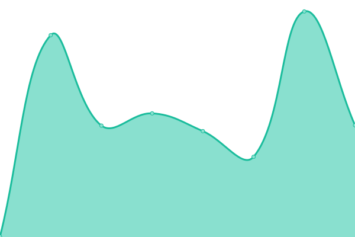
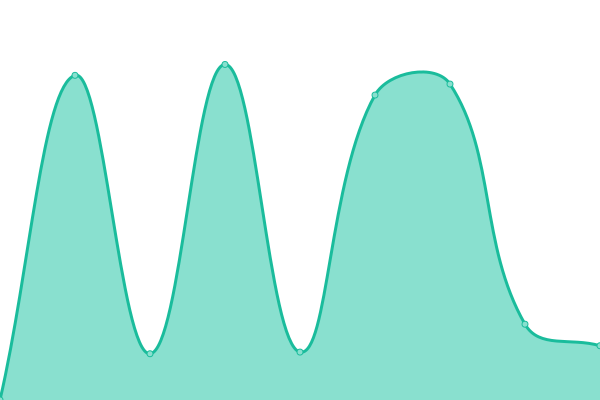
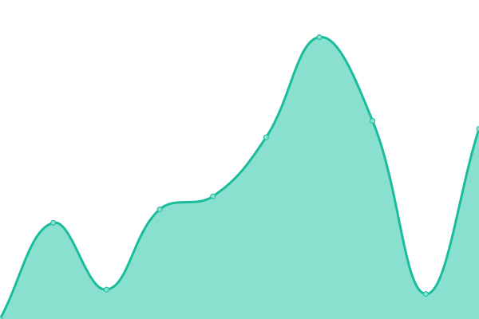
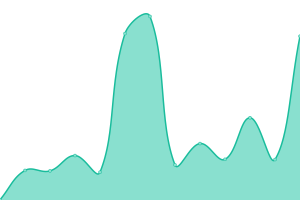
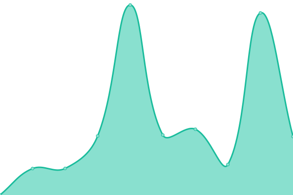

# [📈 Live Status](https://RTUITLab.github.io/upptime): <!--live status--> **🟩 All systems operational**

This repository contains the open-source uptime monitor and status page for [RTU IT Lab](https://rtuitlab.dev), powered by [Upptime](https://github.com/upptime/upptime).

With [Upptime](https://upptime.js.org), you can get your own unlimited and free uptime monitor and status page, powered entirely by a GitHub repository. We use [Issues](https://github.com/RTUITLab/upptime/issues) as incident reports, [Actions](https://github.com/RTUITLab/upptime/actions) as uptime monitors, and [Pages](https://RTUITLab.github.io/RTUITLab/upptime) for the status page.

<!--start: status pages-->
<!-- This summary is generated by Upptime (https://github.com/upptime/upptime) -->
<!-- Do not edit this manually, your changes will be overwritten -->
<!-- prettier-ignore -->
| URL | Status | History | Response Time | Uptime |
| --- | ------ | ------- | ------------- | ------ |
|  [VIKA (.dev)](https://vika.rtuitlab.dev/api/about/vkgroupid) | 🟩 Up | [vika-dev.yml](https://github.com/RTUITLab/upptime/commits/HEAD/history/vika-dev.yml) | 

 1493ms
     
 | 

<a href="https://status.rtuitlab.ru/history/vika-dev">100.00%</a>
    

|  [VIKA (.ru)](https://vika.rtuitlab.ru/api/about/vkgroupid) | 🟩 Up | [vika-ru.yml](https://github.com/RTUITLab/upptime/commits/HEAD/history/vika-ru.yml) | 

 731ms
     
 | 

<a href="https://status.rtuitlab.ru/history/vika-ru">100.00%</a>
    

|  [Landing (.dev)](https://rtuitlab.dev) | 🟩 Up | [landing-dev.yml](https://github.com/RTUITLab/upptime/commits/HEAD/history/landing-dev.yml) | 

 858ms
     
 | 

<a href="https://status.rtuitlab.ru/history/landing-dev">100.00%</a>
    

|  [ITLab](https://manage.rtuitlab.dev) | 🟩 Up | [it-lab.yml](https://github.com/RTUITLab/upptime/commits/HEAD/history/it-lab.yml) | 

 1602ms
     
 | 

<a href="https://status.rtuitlab.ru/history/it-lab">100.00%</a>
    

|  [Olympiad (.dev)](https://olympiad.rtuitlab.dev/api/about) | 🟩 Up | [olympiad-dev.yml](https://github.com/RTUITLab/upptime/commits/HEAD/history/olympiad-dev.yml) | 

 1947ms
     
 | 

<a href="https://status.rtuitlab.ru/history/olympiad-dev">100.00%</a>
    

|  [Olympiad (.ru)](https://olympiad.rtuitlab.ru/api/about) | 🟩 Up | [olympiad-ru.yml](https://github.com/RTUITLab/upptime/commits/HEAD/history/olympiad-ru.yml) | 

 224ms
     
 | 

<a href="https://status.rtuitlab.ru/history/olympiad-ru">100.00%</a>
    

|  [GeoHelper (.dev)](https://geohelper.rtuitlab.dev) | 🟩 Up | [geo-helper-dev.yml](https://github.com/RTUITLab/upptime/commits/HEAD/history/geo-helper-dev.yml) | 

 1982ms
     
 | 

<a href="https://status.rtuitlab.ru/history/geo-helper-dev">100.00%</a>
    

|  [GeoHelper (.ru)](https://geohelper.rtuitlab.ru) | 🟩 Up | [geo-helper-ru.yml](https://github.com/RTUITLab/upptime/commits/HEAD/history/geo-helper-ru.yml) | 

 968ms
     
 | 

<a href="https://status.rtuitlab.ru/history/geo-helper-ru">100.00%</a>
    

|  [Schedule (.dev)](https://schedule-rtu.rtuitlab.dev/api/schedule/get_groups) | 🟩 Up | [schedule-dev.yml](https://github.com/RTUITLab/upptime/commits/HEAD/history/schedule-dev.yml) | 

 2205ms
     
 | 

<a href="https://status.rtuitlab.ru/history/schedule-dev">100.00%</a>
    

|  [Schedule (.ru)](https://schedule-rtu.rtuitlab.ru/api/schedule/get_groups) | 🟩 Up | [schedule-ru.yml](https://github.com/RTUITLab/upptime/commits/HEAD/history/schedule-ru.yml) | 

 1143ms
     
 | 

<a href="https://status.rtuitlab.ru/history/schedule-ru">100.00%</a>
    

|  [Cloud](https://cloud.rtuitlab.dev/status.php) | 🟩 Up | [cloud.yml](https://github.com/RTUITLab/upptime/commits/HEAD/history/cloud.yml) | 

 987ms
     
 | 

<a href="https://status.rtuitlab.ru/history/cloud">100.00%</a>
    

<!--end: status pages-->

[**Visit our status website →**](https://RTUITLab.github.io/upptime)

## 📄 License

- Powered by: [Upptime](https://github.com/upptime/upptime)
- Code: [MIT](./LICENSE) © [RTU IT Lab](https://rtuitlab.dev)
- Data in the `./history` directory: [Open Database License](https://opendatacommons.org/licenses/odbl/1-0/)
