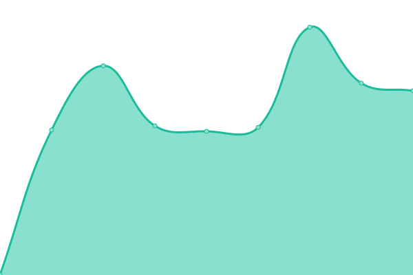
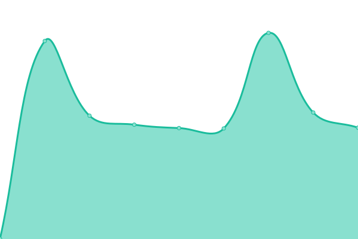

# [📈 Live Status](https://RTUITLab.github.io/upptime): <!--live status--> **🟩 All systems operational**

This repository contains the open-source uptime monitor and status page for [RTU IT Lab](https://rtuitlab.dev), powered by [Upptime](https://github.com/upptime/upptime).

With [Upptime](https://upptime.js.org), you can get your own unlimited and free uptime monitor and status page, powered entirely by a GitHub repository. We use [Issues](https://github.com/RTUITLab/upptime/issues) as incident reports, [Actions](https://github.com/RTUITLab/upptime/actions) as uptime monitors, and [Pages](https://RTUITLab.github.io/RTUITLab/upptime) for the status page.

<!--start: status pages-->
<!-- This summary is generated by Upptime (https://github.com/upptime/upptime) -->
<!-- Do not edit this manually, your changes will be overwritten -->
<!-- prettier-ignore -->
| URL | Status | History | Response Time | Uptime |
| --- | ------ | ------- | ------------- | ------ |
|  [VIKA](https://vika.rtuitlab.dev/api/about/vkgroupid) | 🟩 Up | [vika.yml](https://github.com/RTUITLab/upptime/commits/HEAD/history/vika.yml) | 

 2689ms
     
 | 

<a href="https://status.rtuitlab.dev/history/vika">99.42%</a>
    

|  [Landing](https://rtuitlab.dev) | 🟩 Up | [landing.yml](https://github.com/RTUITLab/upptime/commits/HEAD/history/landing.yml) | 

 2482ms
     
 | 

<a href="https://status.rtuitlab.dev/history/landing">99.43%</a>
    

|  [ITLab](https://manage.rtuitlab.dev) | 🟩 Up | [it-lab.yml](https://github.com/RTUITLab/upptime/commits/HEAD/history/it-lab.yml) | 

 2804ms
     
 | 

<a href="https://status.rtuitlab.dev/history/it-lab">99.60%</a>
    

|  [Olympiad](https://olympiad.rtuitlab.dev) | 🟩 Up | [olympiad.yml](https://github.com/RTUITLab/upptime/commits/HEAD/history/olympiad.yml) | 

 2953ms
     
 | 

<a href="https://status.rtuitlab.dev/history/olympiad">99.80%</a>
    

|  [GeoHelper](https://geohelper.rtuitlab.dev) | 🟩 Up | [geo-helper.yml](https://github.com/RTUITLab/upptime/commits/HEAD/history/geo-helper.yml) | 

 3150ms
     
 | 

<a href="https://status.rtuitlab.dev/history/geo-helper">99.80%</a>
    

|  [StuDo](https://studo.rtuitlab.dev) | 🟩 Up | [stu-do.yml](https://github.com/RTUITLab/upptime/commits/HEAD/history/stu-do.yml) | 

 3257ms
     
 | 

<a href="https://status.rtuitlab.dev/history/stu-do">100.00%</a>
    

|  [Schedule](https://schedule-rtu.rtuitlab.dev/api/schedule/get_groups) | 🟩 Up | [schedule.yml](https://github.com/RTUITLab/upptime/commits/HEAD/history/schedule.yml) | 

 2122ms
     
 | 

<a href="https://status.rtuitlab.dev/history/schedule">99.84%</a>
    

<!--end: status pages-->

[**Visit our status website →**](https://RTUITLab.github.io/upptime)

## 📄 License

- Powered by: [Upptime](https://github.com/upptime/upptime)
- Code: [MIT](./LICENSE) © [RTU IT Lab](https://rtuitlab.dev)
- Data in the `./history` directory: [Open Database License](https://opendatacommons.org/licenses/odbl/1-0/)
